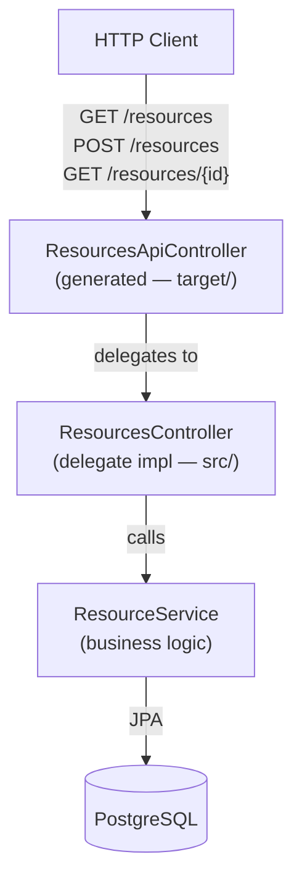

# Architecture

## Overview

**${{ values.name }}** follows a contract-first architecture where the API spec is the single source of truth. The implementation is generated from the spec at each build, guaranteeing contract compliance.

## Request Flow



## Code Generation Pattern

```
openapi.yaml  (external repo: ${{ values.apiName }})
    │
    │  mvn generate-sources
    ▼
target/generated-sources/openapi/
    ├── HealthApi.java              ← interface with Spring MVC annotations
    ├── HealthApiController.java    ← @RestController, injects HealthApiDelegate
    ├── HealthApiDelegate.java      ← interface, default methods return 501
    ├── ResourcesApi.java
    ├── ResourcesApiController.java
    ├── ResourcesApiDelegate.java
    └── model/
        ├── Resource.java
        ├── ResourceRequest.java
        ├── ResourcePage.java
        └── HealthResponse.java

src/main/java/${{ values.packagePath }}/
    ├── controller/
    │   ├── HealthController.java       ← implements HealthApiDelegate   ✏️ editable
    │   └── ResourcesController.java   ← implements ResourcesApiDelegate ✏️ editable
    └── service/
        └── ResourceService.java       ← business logic                  ✏️ editable
```

## Layers

| Layer | Package | Responsibility |
|---|---|---|
| Generated API | `${{ values.packageName }}.api` | Interface + controller + delegate (auto-generated, do not edit) |
| Generated model | `${{ values.packageName }}.api.model` | Request/response POJOs (auto-generated) |
| Delegate impl | `${{ values.packageName }}.controller` | Implements delegate interfaces, wires to service |
| Business logic | `${{ values.packageName }}.service` | Domain rules, no HTTP awareness |
| Data | `${{ values.packageName }}.model` | JPA entities |

## External Dependencies

| Dependency | Protocol | Config |
|---|---|---|
| PostgreSQL | JDBC | `SPRING_DATASOURCE_URL` env var |
| OpenAPI spec repo | HTTPS (Maven build only) | `pom.xml` `inputSpec` URL |

## Build Sequence

1. `mvn generate-sources` → fetches spec, generates `target/generated-sources/`
2. `mvn compile` → compiles generated + source
3. `mvn test` → runs tests (H2 in-memory)
4. `mvn package` → produces fat JAR
