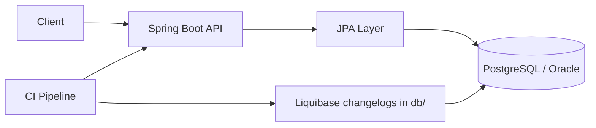

# Architecture

The application exposes HTTP endpoints through Spring Boot and uses JPA for persistence. Liquibase migrations are maintained alongside the service in the `db/` folder for coordinated releases.

## Notes

- application code lives in `src/main/java`
- runtime config lives in `src/main/resources`
- deployment-ready SQL migrations live in `db/src/001_scripts`
