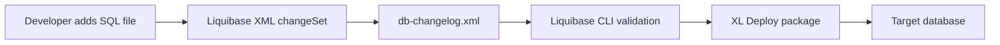

# Architecture

The project follows a simple Liquibase packaging model: XML changelogs orchestrate ordered SQL files, then XL Deploy consumes the generated package.

## Changelog structure

- `db-changelog.xml` is the master entry point
- `001_scripts.xml` defines the first `changeSet`
- `001_scripts.sql` contains SQL statements for the target DBMS
- Backstage template values inject project metadata during scaffold time

## ChangeSet pattern

Use one `changeSet` per logical change, keep IDs immutable and prefer separate SQL files for readability and rollback tracking.

## Mermaid flow

